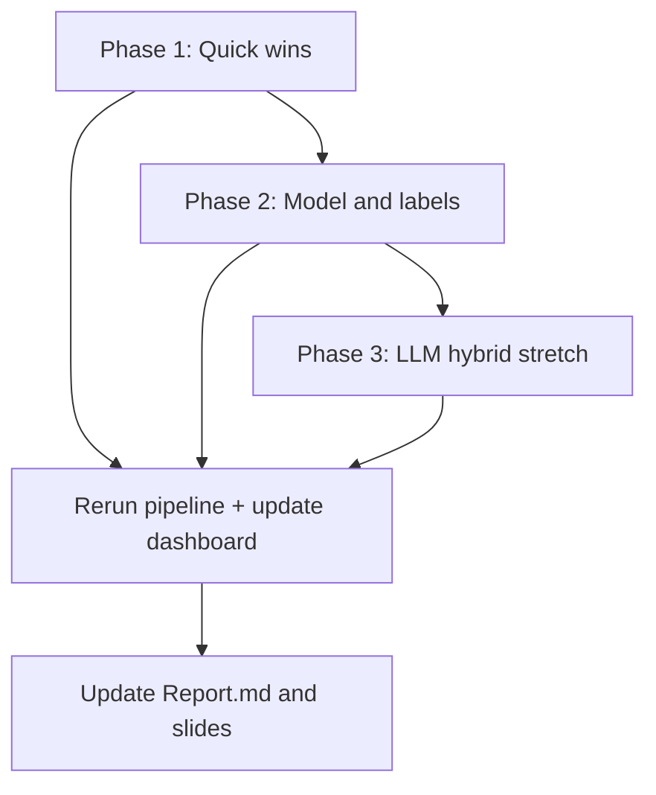

# Model Improvement Plan
## Sentiment & Theme Classification — Post Human-Gold Evaluation

**Audience:** Graduate data mining project team  
**Dataset:** 1,177 Amazon device reviews  
**Repo:** [sudha-coderepo/data_mining](https://github.com/sudha-coderepo/data_mining)  
**Status:** Planned — not yet implemented  
**Created:** August 2026  
**Related docs:** `IMPLEMENTATION_PLAN.md` (original 2-week sprint), `Report.md`, `dashboard.py`

---

## Why scores look lower than before

The pipeline is **more honest**, not necessarily worse. Primary evaluation now uses **100 human-labeled reviews** (Track A) instead of LLM-as-ground-truth or star-only proxies.

| Task | Old setup (easier) | Current setup (harder) | Best on human gold |
|------|-------------------|------------------------|-------------------|
| **Sentiment** | ~86% acc on 236-test vs **stars** | 74% acc / **59% Macro F1** vs **human labels** | Logistic Regression |
| **Theme** | ~77% acc vs **LLM labels** (circular) | 56% acc / **44% Macro F1** vs **human labels** | LLM zero-shot |

### Constraints limiting headline metrics

1. **Human gold is a hard test set** — 49/100 gold reviews have star-mapped sentiment ≠ LLM sentiment.
2. **Theme train/eval mismatch** — models train on `llm_category` but Track A scores against `human_category` (~56% agreement).
3. **Class imbalance** — gold themes: Other (43), Product quality (26), Feature request (15), Price complaint (13), Customer service (3); Delivery barely represented.
4. **Macro F1 penalizes rare classes** — accuracy can look acceptable while Macro F1 stays low.

### Validation reference (Track B — not primary)

On 216 validation reviews vs star-mapped sentiment, Logistic Regression already reaches **~86% accuracy / ~69% Macro F1**. Use this as a sanity check; **Track A remains the primary metric for reporting**.

---

## Goals & success criteria

| Metric | Baseline (Track A, human gold) | Target (Phase 1–2) | Stretch |
|--------|--------------------------------|---------------------|---------|
| Sentiment Macro F1 | 59.0% (LR) | **65–72%** | 75%+ |
| Sentiment accuracy | 74% (LR) | **78–82%** | 85%+ |
| Theme Macro F1 | 43.7% (LLM) | **50–58%** | 65%+ |
| Theme accuracy | 56% (LLM) | **60–68%** | 70%+ |

**Reporting rule:** Always report **Macro F1 on human gold (Track A)** as primary. Track B/C are secondary. Do not chase 80%+ theme accuracy on human gold without label expansion or hybrid LLM routing — document why if targets are not met.

---

## Execution overview



| Phase | Effort | Expected impact |
|-------|--------|-----------------|
| **Phase 1** — Quick wins | 1–2 days | Highest ROI |
| **Phase 2** — Model & label quality | 3–5 days | Solid report improvements |
| **Phase 3** — LLM hybrid (stretch) | 2–3 days | Strong demo narrative |

---

## Phase 1 — Quick wins (1–2 days)

### 1.1 Train theme models on human labels ⭐ Highest priority

**Problem:** Theme classifiers learn `llm_category` but are evaluated on `human_category`.

**Action:**
- [ ] Add training mode: target = `human_category` on gold-labeled rows
- [ ] Use **5-fold cross-validation** on the 100 human labels (80 train / 20 test per fold)
- [ ] Report mean ± std Macro F1 across folds
- [ ] Keep a **held-out 20-review lockbox** (or single stratified 70/30 split) if strict holdout is required for slides

**Files to change:** `scripts/train_models.py`, `scripts/evaluation.py`, optionally new `scripts/train_human_gold_cv.py`

**Expected lift:** Theme Macro F1 from ~30–44% toward **50–60%+**

---

### 1.2 Add star rating as a feature for sentiment

**Problem:** Text-only TF-IDF ignores strong star signal.

**Action:**
- [ ] Concatenate normalized `reviews.rating` (1–5) with TF-IDF features via `ColumnTransformer` or `scipy.sparse.hstack`
- [ ] Retrain sentiment models; evaluate Track A and Track B

**Files to change:** `scripts/preprocess_trainval.py`, `scripts/train_models.py`

**Expected lift:** Sentiment Macro F1 **+5–10 pts** on human gold

---

### 1.3 Richer text features

**Problem:** Char TF-IDF (2–4), 5,000 features, body text only.

**Action:**
- [ ] Combine **word + char** TF-IDF (`FeatureUnion`)
- [ ] Concatenate **title + body** before vectorizing
- [ ] Try `max_features=10000`, `min_df=2`, `sublinear_tf=True`

**Files to change:** `scripts/preprocess_trainval.py`, `scripts/text_utils.py`

**Expected lift:** **+2–5 pts** Macro F1 (both tasks)

---

### 1.4 Threshold tuning for Macro F1

**Problem:** Default 0.5 decision threshold favors majority class.

**Action:**
- [ ] On validation set (216 reviews), tune per-class thresholds to maximize Macro F1
- [ ] Apply tuned thresholds on human gold evaluation
- [ ] Log thresholds in `outputs/metrics/threshold_config.json`

**Files to change:** `scripts/evaluation.py`, new helper in `scripts/baselines.py`

**Expected lift:** Helps rare theme classes; modest overall gain

---

### Phase 1 checklist

- [ ] Implement 1.1–1.4
- [ ] Run `python scripts/run_post_labeling_pipeline.py`
- [ ] Refresh `outputs/metrics/` and `outputs/figures/`
- [ ] Verify `streamlit run dashboard.py` After tab reflects new numbers
- [ ] Add before/after comparison row to `Report.md` §5.3

---

## Phase 2 — Model & label quality (3–5 days)

### 2.1 Stronger classifiers + light hyperparameter search

**Action:**
- [ ] Add `LinearSVC` + `CalibratedClassifierCV`
- [ ] Add `SGDClassifier` (log loss, class_weight balanced)
- [ ] Optional: `XGBoost` / `LightGBM` on TruncatedSVD-reduced TF-IDF
- [ ] GridSearch on **validation only** (216 reviews): `C`, `n_estimators`, `max_depth`
- [ ] Never tune on human gold test set

**Expected lift:** **+3–8 pts** Macro F1 depending on task

---

### 2.2 Collapse or hierarchy for themes

**Problem:** 6-way classification with tiny classes (e.g. Customer service n=3 in gold).

**Action (choose one):**

| Option | Description |
|--------|-------------|
| **A — Merge rare classes** | e.g. Customer service + Delivery → `Service/Shipping` |
| **B — Two-stage hierarchy** | (1) Other vs Specific complaint → (2) fine-grained on complaints only |

- [ ] Document class mapping in `labeling/README.md`
- [ ] Re-evaluate with merged labels; compare Macro F1 fairly (old vs new mapping)

**Expected lift:** Often **+10–15 pts** Macro F1 on themes with clearer presentation story

---

### 2.3 Expand human labels (100 → 150–200)

**Action:**
- [ ] Sample 50–100 additional reviews stratified toward **Delivery**, **Customer service**, **Price complaint**
- [ ] Two annotators label; adjudicate disagreements
- [ ] Run `validate_human_labels.py` → `merge_human_labels.py`
- [ ] Optionally expand gold holdout or use CV only

**Expected lift:** More stable Macro F1 estimates; better rare-class recall

---

### 2.4 Tighten labeling guidelines

**Problem:** ~56% human–LLM theme agreement suggests ambiguous categories.

**Action:**
- [ ] Add 2–3 concrete examples per theme to `labeling/README.md`
- [ ] Adjudication session on 20 disagreement cases; update `LABELING_GUIDE.md` rules
- [ ] Re-label disputed gold rows if needed

**Expected lift:** Raises **ceiling** for all models; better science for the report

---

### Phase 2 checklist

- [ ] Implement chosen items from 2.1–2.4
- [ ] Update evaluation tracks if class schema changes
- [ ] Regenerate confusion matrices (`scripts/evaluation.py`)
- [ ] Update dashboard static “before” baselines if reporting methodology changes

---

## Phase 3 — LLM & hybrid routing (stretch)

### 3.1 Improve LLM theme prompts

**Action:**
- [ ] Refine Gemini prompt with definitions + few-shot examples
- [ ] Optional chain-of-thought: “Quote the phrase that indicates the theme”
- [ ] Re-run labeling on train split only; measure human agreement delta

**Files:** `llm_labeling.py`

---

### 3.2 Hybrid routing demo

**Architecture:**

```
Review → TF-IDF model (fast, local)
         ↓ confidence < 0.55
         → LLM fallback (Gemini)
         ↓ still ambiguous
         → human review queue
```

**Action:**
- [ ] Implement router in `scripts/predict.py` or extend `dashboard.py` Live Prediction tab
- [ ] Report accuracy/cost/latency tradeoff in report

**Value:** Strong presentation narrative even if pure ML Macro F1 stays moderate

---

### 3.3 Fine-tune small transformer (optional)

**Action:** DistilBERT fine-tuned on human labels (requires GPU/time)

**Recommendation:** Skip unless Phase 1–2 complete early and GPU available

---

## Recommended priority order

If time is limited, execute in this order:

1. **1.1** — Train theme on human labels + CV  
2. **1.2** — Star rating feature for sentiment  
3. **2.2** — Merge rare theme classes or two-stage hierarchy  
4. **2.3** — Label 50 more rare-class reviews  
5. **3.2** — Hybrid LLM fallback demo  

---

## Commands reference

```bash
# Full pipeline after code changes
python scripts/run_post_labeling_pipeline.py

# Individual steps
python scripts/create_splits.py          # if splits change
python scripts/preprocess_trainval.py
python scripts/train_models.py
python scripts/evaluation.py

# Dashboard
streamlit run dashboard.py
```

---

## Deliverables when plan is complete

| Deliverable | Location |
|-------------|----------|
| Updated metrics (Track A/B/C) | `outputs/metrics/` |
| Updated figures | `outputs/figures/` |
| Retrained models | `*.pkl` (root) |
| Dashboard reflects new results | `dashboard.py` |
| Report section: improvement results | `Report.md` §5.4 (new) |
| Slides talking points | `slides_guide.md` |

---

## Report narrative (use verbatim if helpful)

> Accuracy and Macro F1 dropped when we switched from LLM-as-ground-truth to human gold evaluation. This reflects **label noise**, **class imbalance**, and **train/eval target mismatch** for themes — not necessarily model regression. Improvements target label alignment, class consolidation, richer features, and hybrid LLM routing rather than inflated accuracy on circular benchmarks.

---

## Progress log

| Date | Phase | Done | Notes |
|------|-------|------|-------|
| 2026-08-05 | — | Plan written | Baseline: Sentiment Macro F1 59% (LR), Theme Macro F1 44% (LLM) on human gold |
| | 1.1 | ☐ | |
| | 1.2 | ☐ | |
| | 1.3 | ☐ | |
| | 1.4 | ☐ | |
| | 2.1 | ☐ | |
| | 2.2 | ☐ | |
| | 2.3 | ☐ | |
| | 2.4 | ☐ | |
| | 3.1 | ☐ | |
| | 3.2 | ☐ | |
| | 3.3 | ☐ | |

---

## Owners

| Phase | Suggested owner | Reviewer |
|-------|-----------------|----------|
| Phase 1 | TBD | TBD |
| Phase 2 | TBD | TBD |
| Phase 3 | TBD | TBD |

*Update owners and progress log as work proceeds.*
