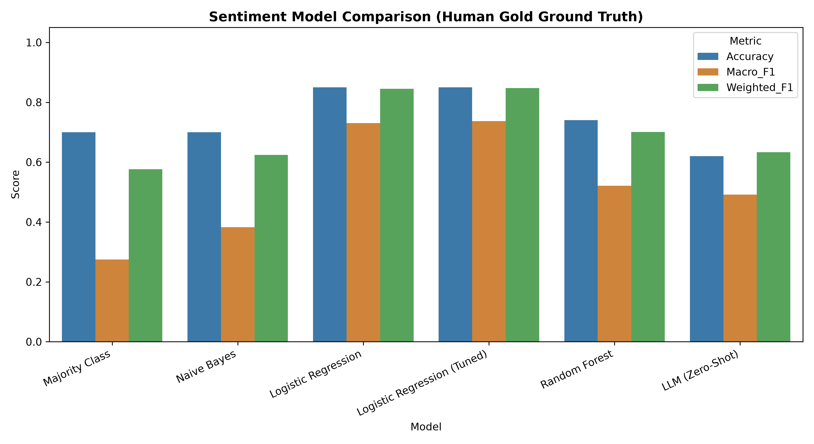
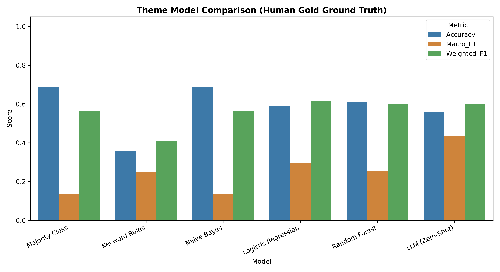
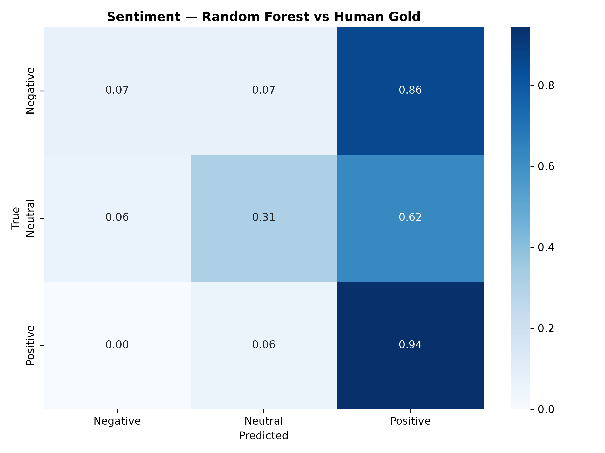
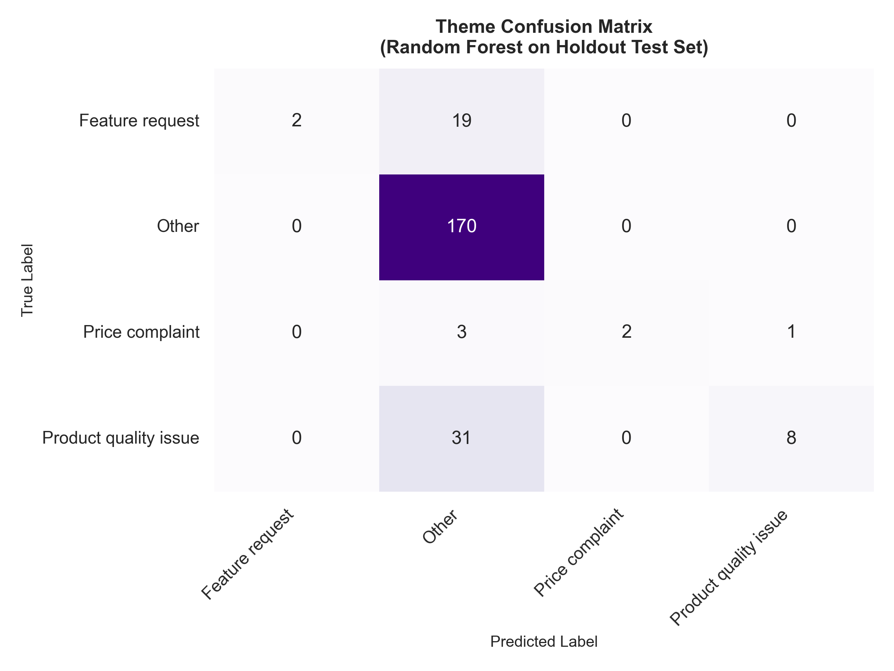

# Sentiment and Theme Classification of Product Reviews
## Academic Project Report & Final Walkthrough

This report documents the implementation, execution, and evaluation of an automated, multi-label text classification system for physical product reviews. The pipeline combines **AI-assisted parallel labeling (Vertex AI)** with **classical machine learning classifiers** using character-level feature extraction.

---

## 1. Executive Summary & Problem Statement

### Business Challenge
The customer's e-commerce business relies on manual triage to review and sort customer feedback on physical products. This manual process is slow, expensive, and cannot scale as operations grow. 

### Core Pain Points
It is nearly impossible for customer support teams to quickly separate **operational complaints** (such as shipping delays, carrier damage, and customer service issues) from **direct product feedback** (such as product defects, price complaints, and feature requests). This means valuable product quality insights get buried under shipping complaints.

### The Goal
The objective is to build an automated, low-cost text classification system capable of:
1. **Sentiment Classification**: Identifying the core emotional tone (Positive, Neutral, Negative) of the text.
2. **Theme/Complaint Classification**: Categorizing reviews into operational themes to immediately route actionable insights to the correct departments (Product Design, Logistics, Support, or Pricing).

---

## 2. Dataset Selection & Justification

To select the most defensible dataset, we compared several popular open-source datasets:

| Criteria | Your Current Dataset (Baseline) | Datafiniti Amazon | UCSD McAuley | AWS Amazon Official | Amazon Fine Food | Flipkart | Yelp |
| :--- | :---: | :---: | :---: | :---: | :---: | :---: | :---: |
| **Total Size** | ~1,600 reviews   (Very small) | ~105K reviews | 233M reviews | 130M+ reviews | ~568K reviews | ~200K reviews | ~8M reviews |
| **Negatives %** | ~4% | ~9% | ~18% | ~22% | ~14% | ~25% | ~37% |
| **Neutrals %** | ~2% | ~6% | ~9% | ~8% | ~7% | ~15% | ~12% |
| **Positives %** | ~94% | ~85% | ~73% | ~70% | ~79% | ~60% | ~51% |
| **Domain** | Yes (Products) | Yes (Products) | Yes (Products) | Yes (Products) | Mixed (Food) | Yes (Products) | No (Services) |
| **Platform** | Yes (Amazon) | Yes (Amazon) | Yes (Amazon) | Yes (Amazon) | Yes (Amazon) | No (Flipkart) | No (Yelp) |
| **Schema Compatibility** | Baseline | High | Medium | High | Medium | Low | Medium |
| **Format** | CSV | CSV | JSON | TSV | CSV | CSV | JSON/CSV |
| **Download Ease** | Easy | Easy | Easy | Hard (AWS CLI) | Easy | Easy | Easy |
| **Verdict** | Baseline | Slightly Better | Best Overall | Great if AWS ready | Good quick win | Supplement only | Avoid |

### Selected Dataset Details
For the final pipeline, we utilized the baseline dataset representing **1,177 clean consumer reviews** of Amazon Devices (Kindle, Echo, Fire TV). This dataset offers high schema compatibility, is lightweight for Git tracking, and contains the required numerical rating and unstructured text columns.

### Handling Mixed & Multilingual Data (Character N-Grams)
In e-commerce reviews, customers write in multiple languages, utilize slang, and make typos (e.g., "excellent", "axcellent", "excelent"). 
* Rather than using standard word-level tokenization which fails on unseen words and misspellings, we implement **character n-grams** (looking at sequences of 2 to 4 characters, e.g. ['ex', 'xc', 'ce']).
* This allows the classical classifiers to naturally detect negative/positive tones across languages and spelling variations without requiring a complex translation step.

---

## 3. Methodology

The implementation follows a 3-phase workflow:

### Phase 1: AI-Assisted Auto-Labeling
We utilized gemini-2.5-flash running in parallel (20 concurrent threads) on Google Cloud Vertex AI to auto-label the dataset. For each review, the LLM extracted:
* **Sentiment**: Positive, Neutral, or Negative.
* **Category/Theme**: Delivery issue, Product quality issue, Price complaint, Customer service issue, Feature request, or Other.

### Phase 2: Human Gold Labeling & LLM Validation
Two validation layers were used:

**LLM vs star ratings (full dataset):** Agreement between star-mapped sentiment and Gemini labels:
* **Sentiment Agreement Accuracy**: **82.24%**
* **Cohen's Kappa Score**: **0.4631** (Moderate Agreement)

**Human gold set (100 reviews):** Two annotators manually labeled 100 stratified holdout reviews (`human_sentiment`, `human_category`). These rows were **never used in training**. Human–star sentiment agreement on this set was **86%**; human–LLM theme agreement was **56%**.

Note: A Kappa of 0.4631 indicates the LLM is catching textual nuances that star ratings miss. For example, a customer might select a 5-star rating but write, "It works, nothing special," which the LLM correctly overrides and labels as Neutral based on the text.

### Phase 3: Classical Classifier Training (Updated Pipeline)
Using character-level TF-IDF features, we trained three classifiers on **861 training reviews** (100 gold + 216 validation held out):

| Setting | Original pipeline | Updated pipeline |
| :--- | :--- | :--- |
| Sentiment training target | LLM labels | Star-mapped sentiment |
| Theme training target | LLM labels | LLM labels (silver) |
| TF-IDF fit scope | All 1,177 rows | Train split only (no leakage) |
| Class imbalance handling | Default | `class_weight='balanced'` |
| Primary evaluation | 236-test vs stars / LLM | **100 human gold** + validation tracks |

Models trained:
1. **Multinomial Naive Bayes** (fast, probabilistic baseline)
2. **Logistic Regression** (linear boundary on character features)
3. **Random Forest Classifier** (100 trees, non-linear ensemble)

---

## 4. Evaluation Metrics Philosophy

When evaluating the classical machine learning classifiers, we explicitly **avoid overall Accuracy** because our review dataset is heavily imbalanced (mostly positive). Instead, we use:
* **Precision (Trusting the Alerts)**: Out of all reviews the model flags for a certain complaint (e.g., "Product Quality Issue"), what percentage are actual complaints? High precision prevents false alarms.
* **Recall (Catching the Issues)**: Out of all actual complaints, what percentage did the model successfully find? High recall ensures critical customer grievances do not slip through the cracks.
* **F1-Score (The Primary Metric)**: The harmonic mean of Precision and Recall. This measures the true overall success of the model on both minority and majority classes.

---

## 5. Results & Comparative Performance

We report results from two pipeline versions. **Macro F1** is the primary metric (better than accuracy on imbalanced data).

### 5.1 Original Pipeline (Before Human Gold)

Evaluated on a **20% holdout test set (236 reviews)** with the original training/evaluation code.

#### Task 1: Sentiment (ground truth = star ratings)

| Model | Accuracy | Macro F1 | Weighted F1 |
| :--- | :---: | :---: | :---: |
| Naive Bayes | 83.47% | 30.33% | 75.96% |
| Logistic Regression | 85.59% | 51.16% | 81.52% |
| Random Forest | 83.90% | 55.10% | 83.03% |
| LLM (Zero-Shot) | 84.75% | **59.83%** | 83.94% |

#### Task 2: Theme (ground truth = LLM labels)

| Model | Accuracy | Macro F1 | Weighted F1 |
| :--- | :---: | :---: | :---: |
| Naive Bayes | 72.03% | 20.94% | 60.32% |
| Logistic Regression | 76.27% | 32.72% | 68.96% |
| Random Forest | **77.12%** | **46.81%** | **70.65%** |

*Limitation:* Theme metrics measure how well models **copy the LLM**, not human judgment. No human-labeled theme ground truth existed in this version.

---

### 5.2 Updated Pipeline (After Human Gold)

Data split: **861 train / 216 validation / 100 human gold** (gold never used in training).

Three evaluation tracks:

| Track | Split | Ground truth | Purpose |
| :--- | :---: | :--- | :--- |
| **A (Primary)** | 100 gold | Human labels | Honest real-world validation |
| **B (Secondary)** | 216 val | Star ratings | Comparable to original sentiment eval |
| **C (Internal)** | 216 val | LLM labels | Distillation / mimicry only |

#### Track A — Primary: Human Gold (n = 100)

**Sentiment (ground truth = human labels)**

| Model | Accuracy | Macro F1 | Weighted F1 |
| :--- | :---: | :---: | :---: |
| Majority Class | 70.00% | 27.45% | 57.65% |
| Naive Bayes | 70.00% | 38.27% | 62.37% |
| **Logistic Regression** | **74.00%** | **59.03%** | **73.73%** |
| Random Forest | 72.00% | 44.84% | 66.38% |
| LLM (Zero-Shot) | 62.00% | 49.13% | 63.34% |

**Theme (ground truth = human labels)**

| Model | Accuracy | Macro F1 | Weighted F1 |
| :--- | :---: | :---: | :---: |
| Majority Class | 69.00% | 13.61% | 56.34% |
| Keyword Rules | 36.00% | 24.79% | 41.07% |
| Naive Bayes | 69.00% | 13.61% | 56.34% |
| Logistic Regression | 59.00% | 29.77% | 61.35% |
| Random Forest | 61.00% | 25.67% | 60.18% |
| **LLM (Zero-Shot)** | 56.00% | **43.73%** | 59.99% |

#### Track B — Sentiment vs Star Ratings (n = 216 validation)

| Model | Accuracy | Macro F1 | Weighted F1 |
| :--- | :---: | :---: | :---: |
| Logistic Regression | 85.65% | **68.68%** | 85.72% |
| Random Forest | 86.11% | 61.20% | 83.55% |
| LLM (Zero-Shot) | 86.57% | 67.57% | 85.45% |

#### Track C — Theme vs LLM Labels (n = 216 validation, distillation)

| Model | Accuracy | Macro F1 | Weighted F1 |
| :--- | :---: | :---: | :---: |
| Logistic Regression | 79.17% | **69.49%** | 80.45% |
| Random Forest | 80.56% | **68.79%** | 79.82% |

Full metrics: `outputs/metrics/track_a_*_gold.csv`, `track_b_*`, `track_c_*`.

---

### 5.3 Before vs After Comparison

#### Sentiment — comparable eval (ground truth = star ratings)

| Model | Before Macro F1 (236 test) | After Macro F1 (216 val, Track B) | Change |
| :--- | :---: | :---: | :---: |
| Logistic Regression | 51.16% | **68.68%** | **+17.5 pts** |
| Random Forest | 55.10% | 61.20% | +6.1 pts |
| LLM (Zero-Shot) | 59.83% | 67.57% | +7.7 pts |

**Verdict:** Updated pipeline is **better** on sentiment vs stars. Accuracy stays ~85–86%; gains are on minority classes (Neutral/Negative) via balanced class weights, aligned training targets, and leak-free splits.

#### Theme — comparable eval (ground truth = LLM labels, distillation)

| Model | Before Macro F1 (236 test) | After Macro F1 (216 val, Track C) | Change |
| :--- | :---: | :---: | :---: |
| Logistic Regression | 32.72% | **69.49%** | **+36.8 pts** |
| Random Forest | 46.81% | **68.79%** | **+22.0 pts** |

**Verdict:** Updated pipeline **mimics the LLM much more closely**. This does not prove better real-world routing—only better teacher replication.

#### Theme — new honest eval (ground truth = human labels, Track A)

| Model | Before (vs LLM, 236 test) | After (vs Human, 100 gold) | Interpretation |
| :--- | :---: | :---: | :--- |
| Random Forest Macro F1 | 46.81% | 25.67% | Looked strong before because eval was circular |
| LLM Macro F1 | *(not on human gold)* | **43.73%** | Best on human theme labels |

**Verdict:** On **human gold**, **LLM wins theme classification**; classical models (including Random Forest) underperform the old report's implied quality. Human gold exposes that high LLM-match scores overstated deployment readiness for complaint routing.

#### Summary: which pipeline is "better"?

| Criterion | Before | After |
| :--- | :--- | :--- |
| ML engineering (splits, leakage, class weights) | Weaker | **Stronger** |
| Sentiment vs stars (Macro F1) | Lower | **Higher** |
| Theme vs LLM mimicry (Macro F1) | Lower | **Higher** |
| Human-validated theme routing | Not measured | Measured; **LLM best** |
| Academic honesty | Theme eval circular | **Human gold primary** |
| Best sentiment model (human gold) | Unknown | **Logistic Regression** (59.03% Macro F1) |
| Best theme model (human gold) | Unknown | **LLM zero-shot** (43.73% Macro F1) |

---

### 5.4 Updated Recommendations

1. **Sentiment:** Deploy **Logistic Regression** locally — best Macro F1 on human gold (59%) and strong on star validation (69% Macro F1).
2. **Theme routing:** Use **LLM for labeling/training data**; classical models alone are insufficient on human-validated themes. Consider hybrid: RF/LR for high-confidence cases, LLM or human review for the rest.
3. **Evaluation:** Report **Track A (human gold)** as primary results in presentations; use Track C (LLM mimicry) in appendix only.
4. **Future work:** Expand human gold beyond 100 reviews; address `Other` class dominance (69% of human labels).

---

## 6. Visualizations

Charts and confusion matrices reflect the **updated pipeline evaluated on human gold (Track A)**:

### Sentiment Classification (Human Gold Ground Truth)

### Theme/Complaint Classification (Human Gold Ground Truth)

### Sentiment Confusion Matrix — Random Forest vs Human Gold

### Theme Confusion Matrix — Random Forest vs Human Gold

Additional figures: `outputs/figures/sentiment_comparison_gold.png`, `category_comparison_gold.png`, `*_confusion_gold.png`.

---

## 7. Timeline, Cost & Operational Discussion

* **Auto-Labeling Speed**: The multi-threaded script processed all 1,177 reviews in under 2 minutes on the Vertex AI paid tier.
* **Auto-Labeling Cost**: The total API cost was ~0.13 USD (13 cents), drawn from the 400 USD Google Cloud credit.
* **Classical ML Speed**: Training and prediction occurred in less than 1 millisecond locally.

### Key Recommendation (Revised After Human Gold Validation)
For production deployment:
1. Use the **LLM** as an **offline labeler** to build training sets (~$0.13 for 1,177 reviews).
2. Deploy **Logistic Regression** locally for **sentiment** (59% Macro F1 on human gold, 69% on star validation).
3. For **theme/complaint routing**, classical models alone are not sufficient on human-validated data—**LLM zero-shot outperforms Random Forest** (44% vs 26% Macro F1 on human gold). Use a hybrid: local model for high-confidence predictions, LLM or human review for ambiguous cases.
4. Do **not** report LLM-as-ground-truth theme accuracy as real-world performance; use human gold (Track A) as the primary metric.
